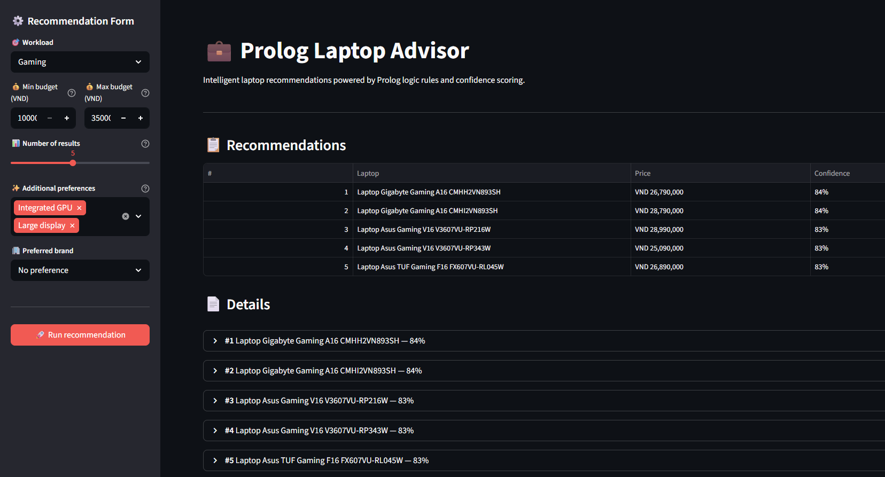

# 💻 Prolog Laptop Expert System



A Streamlit app that uses Prolog rules to recommend laptops based on budget, workload,
and user preferences. The Python app bridges to Prolog via `pyswip` and displays
ranked recommendations with confidence scores.

---

## ✨ Highlights

- Interactive sidebar form to collect workload, budget, traits, and brand preference
- Prolog-backed reasoning engine for deterministic, explainable recommendations
- Ranked Top-K results with confidence scores and expandable details
- Raw Prolog query viewer for debugging and rule inspection

---

## System Requirements

- Python 3.11 or newer
- SWI-Prolog (separate system package; must be installed and on your `PATH`)
- A POSIX-like or Windows PowerShell environment (virtualenv recommended)

Note: `SWI-Prolog` is a system dependency, not a pip package. Verify with:

```bash
swipl --version
```

---

## Python Dependencies (current)

The repository `requirements.txt` currently lists the Python packages (no pinned
versions):

- `streamlit`
- `pyswip`

Important notes:

- `pyswip` is a Python wrapper that requires SWI-Prolog to be installed on your
    system. Installing `pyswip` alone via pip is not sufficient.
- The `requirements.txt` has no version pins. For reproducible installs consider
    pinning versions or generating a locked file after you validate the environment
    (e.g. `pip freeze > requirements.txt`). Leave as-is if you prefer flexible installs.

---

## Installation

1. Create and activate a virtual environment.

Windows (PowerShell):

```powershell
python -m venv .venv
.\.venv\Scripts\Activate.ps1
```

macOS / Linux:

```bash
python -m venv .venv
source .venv/bin/activate
```

2. Install Python dependencies:

```bash
pip install -r requirements.txt
```

3. Install SWI-Prolog:

- Windows: Download installer from https://www.swi-prolog.org or use Chocolatey:

```powershell
choco install swi-prolog
```

- macOS: `brew install swi-prolog`
- Linux: use your distro package manager, e.g. `apt install swi-prolog`

Verify `swipl` is on `PATH` before running the app.

---

## Running the App

Always use Streamlit's runner so the web server and UI lifecycle are initialized
correctly. From the project root run:

```bash
streamlit run main.py
# or equivalently:
python -m streamlit run main.py
```

Why `streamlit run`?

- `streamlit run` starts Streamlit's HTTP server, sets up its runtime environment,
    and manages reruns/hot-reload and session state. Running `python main.py`
    executes the file as a plain Python script and will not start Streamlit's
    server in the same way — the UI may not appear or behave as expected.

If you prefer to experiment, you can `python main.py` in some environments, but
`streamlit run` is the supported and recommended invocation.

---

## Usage

1. Open the sidebar and select a workload (Office, Programming, iOS Development,
     Graphics, Gaming, or AI/Data Science).
2. Enter a min/max budget in VND.
3. Select additional trait preferences and an optional preferred brand.
4. Click "Run recommendation" to fetch results.
5. Expand entries for details and view the raw Prolog query under Debug.

---

## Project Files

- `main.py` — Streamlit UI and Prolog bridge
- `laptop_advisor.pl` — Prolog rules and ranking logic
- `laptop_database.pl` — Laptop facts database
- `requirements.txt` — Python dependencies (no pinned versions)

---

## Troubleshooting

- If `pyswip` fails to import, ensure SWI-Prolog is installed and `swipl` is on
    your `PATH` and then reinstall `pyswip` inside the active virtualenv.
- On Windows, set the asyncio event loop policy as shown in `main.py` (already
    handled by the app) to avoid event-loop issues.
- If the UI does not appear, confirm you launched with `streamlit run main.py`.

---

## Final Notes

- The `requirements.txt` is minimal and unpinned by design. If you want a
    reproducible environment, pin versions after validating a working setup.
- If you'd like, I can update `requirements.txt` to add pinned versions or
    include dev/test dependencies — tell me which approach you prefer.

---

Happy testing! If you want, I can also add a short CONTRIBUTING or DEV guide.
